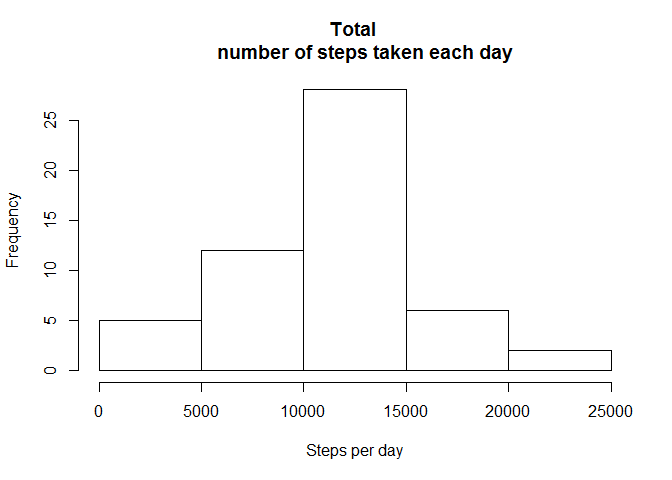
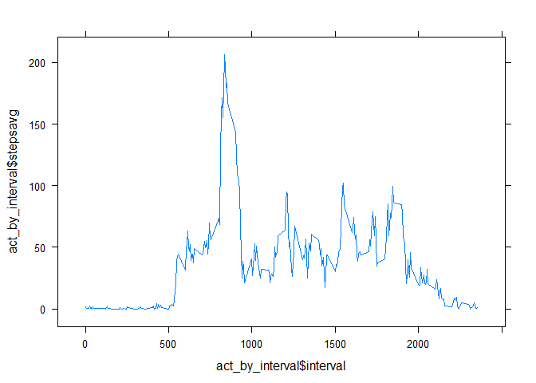
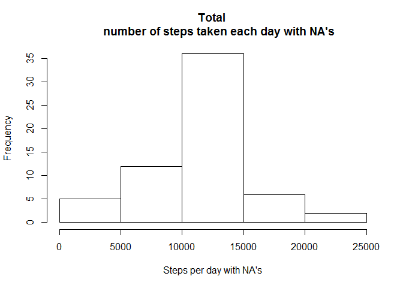
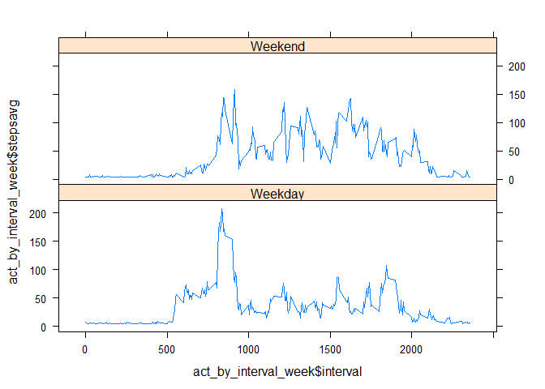

# Reproducible Research Assignment 1
## Introduction

This assignment makes use of data from a personal activity monitoring
device. This device collects data at 5 minute intervals through out the
day. The data consists of two months of data from an anonymous
individual collected during the months of October and November, 2012
and include the number of steps taken in 5 minute intervals each day.

## Data

The data for this assignment can be downloaded from the course web
site:

* Dataset: [Activity monitoring data](https://d396qusza40orc.cloudfront.net/repdata%2Fdata%2Factivity.zip) [52K]

The variables included in this dataset are:

* **steps**: Number of steps taking in a 5-minute interval (missing
    values are coded as `NA`)

* **date**: The date on which the measurement was taken in YYYY-MM-DD
    format

* **interval**: Identifier for the 5-minute interval in which
    measurement was taken


The dataset is stored in a comma-separated-value (CSV) file and there
are a total of 17,568 observations in this
dataset.

## Assignment

Fork/clone the [GitHub repository created for this
assignment](http://github.com/rdpeng/RepData_PeerAssessment1).

[My own Github repo](https://github.com/AllenChioa/RepData_PeerAssessment1)

## Loading and preprocessing the data

Download the data manually from [Activity monitoring data](https://d396qusza40orc.cloudfront.net/repdata%2Fdata%2Factivity.zip) [52K] , and unzip to your wd to get file `activity.csv`, then run R code below to load into dataset


```r
activity <- read.csv("activity.csv")
```

## What is mean total number of steps taken per day?

remove the NA Record,and draw the hist, and calc the mean,median


```r
activity1<-subset(activity,is.na(activity$steps)==FALSE)
hist(tapply(activity1$steps,as.character(activity1$date),sum),main = "Total 
    number of steps taken each day",xlab = "Steps per day")
```

 

```r
summary(tapply(activity1$steps,as.character(activity1$date),sum))
```

```
##    Min. 1st Qu.  Median    Mean 3rd Qu.    Max. 
##      41    8841   10760   10770   13290   21190
```

## What is the average daily activity pattern?
draw the plot

```r
act_by_interval<-aggregate(activity1$steps,by = list(activity1$interval),"mean")
colnames(act_by_interval)<-c("interval","stepsavg")
library(lattice)
xyplot(act_by_interval$stepsavg~act_by_interval$interval,layout=c(1,1),type="l")
```

 

calc the max value's interval


```r
act_by_interval[act_by_interval$stepsavg==max(act_by_interval$stepsavg),]
```

```
##     interval stepsavg
## 104      835 206.1698
```

## Imputing missing values

calc the NA's "TRUE", and mean of 5 interval

```r
activity2<-activity
table(is.na(activity2$steps))
```

```
## 
## FALSE  TRUE 
## 15264  2304
```
filling in the missing value with mean

```r
mean<-mean(activity2$steps,na.rm = T)
activity2$steps<-as.numeric(replace(activity2$steps,is.na(activity2$steps==F),mean))
```
draw the Hist for Dataset with NA's

```r
hist(tapply(activity2$steps,as.character(activity2$date),sum),main = "Total 
    number of steps taken each day with NA's",xlab = "Steps per day with NA's")
```

 
calc the mean and median

```r
summary(tapply(activity2$steps,as.character(activity2$date),sum))
```

```
##    Min. 1st Qu.  Median    Mean 3rd Qu.    Max. 
##      41    9819   10770   10770   12810   21190
```


## Are there differences in activity patterns between weekdays and weekends?
new variable Week, and preprocess the data into new dataset activity3

```r
library("dplyr")
```

```
## 
## Attaching package: 'dplyr'
## 
## The following object is masked from 'package:stats':
## 
##     filter
## 
## The following objects are masked from 'package:base':
## 
##     intersect, setdiff, setequal, union
```

```r
activity3<-mutate(activity2,week=ifelse(weekdays(as.Date(activity2$date)) =="Sunday" | weekdays(as.Date(activity2$date)) =="Saturday", "Weekend","Weekday"))

act_by_interval_week<-aggregate(activity3$steps,by = list(activity3$interval,activity3$week),"mean")
colnames(act_by_interval_week)<-c("interval","week","stepsavg")
```
draw the plot

```r
library(lattice)
xyplot(act_by_interval_week$stepsavg~act_by_interval_week$interval|act_by_interval_week$week,
layout=c(1,2),type="l")
```

 
